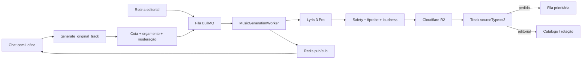

# Músicas originais geradas para o Lofiever

Status: MVP implementado; ativação depende de credenciais e bake-off
Data: 2026-07-18
Escopo: decisão de produto, UX, arquitetura e runbook do MVP.

## Estado da implementação

Implementado em 2026-07-18:

- tool `request_original_track` no chat, separada de pedidos do catálogo;
- autenticação NextAuth pelo socket, confirmação 18+, cota individual/global e budget gate;
- domínio Prisma `MusicGeneration`, proveniência em `Track.origin` e migration aditiva;
- BullMQ com concorrência 1, até uma retentativa e idempotência por mensagem;
- provider Lyria 3 Pro via Google Cloud Interactions API;
- validação fail-closed com `ffprobe`, silêncio, volume, detecção de voz, normalização a -14 LUFS e hash de duplicidade exata;
- preservação do MP3 original e derivado de streaming no R2;
- pedido direto na janela 3–5, sem três faixas geradas por usuários consecutivas;
- geração editorial automática e limite de uma faixa gerada a cada cinco posições da rotação espontânea;
- avisos no chat quando a faixa é publicada ou falha.
- título obrigatório e crédito fixo `Lofine DJ` no catálogo, player e metadados ID3 do derivado de streaming.

Para ativar, configurar GitHub OAuth, Google Cloud/ADC ou `GOOGLE_SERVICE_ACCOUNT_JSON`, R2, OpenAI e as variáveis `AI_MUSIC_*` documentadas em `.env.example`; depois executar `prisma migrate deploy` e habilitar `AI_MUSIC_ENABLED=true`. O fallback Stable Audio continua atrás da fronteira de provider, mas não está implementado/ativado neste MVP. Antes do lançamento público ainda é obrigatório executar o bake-off de 50 prompts e reconferir os termos do provedor.

## Decisão recomendada

Usar **Google Lyria 3 Pro Preview** como provedor principal para o MVP e **Stable Audio 3.0** como adaptador de fallback, inicialmente desativado. A geração acontece de forma assíncrona e sempre produz lo-fi instrumental. Toda faixa aprovada é armazenada no R2 e registrada como uma `Track` tocável (`sourceType = s3`), reaproveitando a fila e o streaming sincronizado que já existem.

O Lyria 3 Pro é a opção mais adequada porque:

- gera uma música completa de até 184 segundos em MP3, 44,1 kHz e 192 kbps;
- possui modo instrumental, controle de duração/BPM/intensidade, filtros de entrada, recitação e semelhança vocal;
- aplica SynthID e Content Credentials/C2PA;
- aceita português nos prompts;
- custa US$ 0,08 por música completa de até três minutos;
- embora esteja em Preview, sua documentação permite explicitamente uso comercial/produção e divulgação do output a terceiros.

Fontes: [capacidades e condições de produção do Lyria 3](https://docs.cloud.google.com/gemini-enterprise-agent-platform/models/lyria/lyria-3), [preço do Lyria](https://cloud.google.com/gemini-enterprise-agent-platform/generative-ai/pricing?hl=pt-BR), [API REST](https://docs.cloud.google.com/gemini-enterprise-agent-platform/models/music/generate-music?hl=en), [model card](https://deepmind.google/models/model-cards/lyria-3/).

### Por que não usar ElevenLabs como principal

Eleven Music tem uma API excelente, `force_instrumental`, duração configurável e preço de US$ 0,15/minuto. Porém, os termos específicos de 26 de maio de 2026 excluem **radio** dos direitos de mídia em todos os planos self-service; somente Enterprise Music cobre todos os usos de mídia. Antes de usá-lo no Lofiever, seria necessário obter autorização contratual/Enterprise por escrito.

Fontes: [API Music](https://elevenlabs.io/docs/api-reference/music/compose), [preço](https://elevenlabs.io/pricing/api), [direitos por plano](https://elevenlabs.io/eleven-music-model-specific-terms), [restrições de prompts](https://elevenlabs.io/music-terms).

### Fallback e alternativas

- **Stable Audio 3.0**: API assíncrona, MP3/WAV, até seis minutos e US$ 0,26 por geração concluída. A Stability atribui ao cliente seus eventuais direitos sobre o output e permite comercialização nos termos aplicáveis. É o melhor segundo adaptador. Fontes: [API](https://platform.stability.ai/docs/api-reference), [preço](https://platform.stability.ai/pricing), [termos](https://stability.ai/terms-of-service), [licença](https://stability.ai/license).
- **Suno**: não foi encontrada uma API pública oficial documentada. Integrações não oficiais não devem sustentar a rádio.
- **Lyria 2**: é seguro e instrumental, mas limitado a clipes de 30 segundos; não serve como faixa principal.

## Cotas e orçamento sugeridos

### Pedidos de usuários

- 1 música concluída por usuário autenticado a cada dia, com reset em UTC e sem acumular saldo.
- 1 pedido ativo por usuário e por IP.
- conta verificada e confirmação de idade 18+ antes do primeiro pedido.
- teto global inicial de 20 músicas solicitadas por dia.
- prompt bloqueado antes da geração não consome cota.
- falha definitiva ou rejeição técnica devolve a cota do usuário.
- tentativas no provedor sempre consomem o orçamento global, mesmo quando a cota do usuário é devolvida.

Pedidos por convidados não entram no MVP. A geração deve combinar `userId`, IP, confirmação 18+ e teto global. A restrição etária é um gate de lançamento enquanto os termos do Google proibirem oferecer o serviço generativo em um app dirigido a, ou provavelmente acessado por, menores de 18 anos. A reprodução da rádio continua separada da permissão de gerar; a redação e o fluxo final exigem revisão jurídica antes da abertura pública. Fonte: [Google Cloud Service Specific Terms](https://cloud.google.com/terms/service-terms).

### Produção editorial do Lofiever

- 2 músicas automáticas por dia, em horários separados, até formar um catálogo de aproximadamente 300 faixas autorais aprovadas.
- depois de 300 faixas, reduzir para 3 músicas novas por semana.
- pausar automaticamente quando o orçamento mensal atingir o limite.
- usar humor recente do chat e lacunas do catálogo para variar BPM, instrumentação e mood.
- não gerar quando já houver um job editorial ativo.

### Estimativa

| Origem | Máximo mensal | Custo unitário | Custo base |
|---|---:|---:|---:|
| Usuários | 600 faixas | US$ 0,08 | US$ 48,00 |
| Lofiever | 60 faixas | US$ 0,08 | US$ 4,80 |
| Total | 660 faixas |  | **US$ 52,80/mês** |

Configuração inicial recomendada:

- `AI_MUSIC_USER_DAILY_LIMIT=1`
- `AI_MUSIC_GLOBAL_DAILY_LIMIT=20`
- `AI_MUSIC_EDITORIAL_DAILY_TARGET=2`
- `AI_MUSIC_EDITORIAL_CATALOG_TARGET=300`
- `AI_MUSIC_EDITORIAL_WEEKLY_TARGET=3`
- `AI_MUSIC_MONTHLY_BUDGET_USD=100`
- `AI_MUSIC_MAX_ATTEMPTS=2`

Com 25% de folga para regenerações, o custo no Lyria seria de aproximadamente US$ 66/mês. Em um cenário com 10% das faixas no fallback Stable Audio, a reserva fica próxima de US$ 81/mês. O hard budget de US$ 100 e o kill switch evitam gasto aberto. Se todo o tráfego precisar migrar para o fallback, o sistema deve reduzir automaticamente a cota global ou exigir uma decisão explícita antes de elevar o teto para aproximadamente US$ 250/mês.

Uma faixa MP3 de 184 segundos a 192 kbps ocupa aproximadamente 4,4 MB. As 660 faixas mensais do cenário máximo adicionariam cerca de 2,9 GB ao R2 por mês, antes de originais WAV, derivados e redundância.

## Política de programação

### Solicitação direta

Quando a faixa passa na validação:

1. o chat informa que ela ficou pronta;
2. a faixa entra na fila prioritária depois do áudio já bufferizado pelo Liquidsoap;
3. a promessa de UX é tocar **entre as próximas 3–5 faixas**, não “imediatamente”;
4. no início da reprodução, Lofine anuncia a música e credita o pedido ao usuário;
5. no máximo duas faixas geradas por usuários podem tocar consecutivamente.

### Produção autônoma

- entra no catálogo sem furar a fila;
- participa da seleção normal com meta inicial de 10–20% da rotação espontânea;
- nunca ocupa mais de uma em cada cinco posições da fila gerada automaticamente;
- pode ser promovida na primeira reprodução, mas sem prioridade equivalente a pedido direto.

## Pipeline de validação automática

O gate é fail-closed: se qualquer etapa essencial não responder, a faixa não é publicada.

1. **Identidade, idade, cota e orçamento** — exige conta verificada e confirmação 18+, depois reserva cota e budget de forma atômica.
2. **Moderação do pedido** — aceita apenas lo-fi instrumental; remove dados pessoais; bloqueia nomes de artistas, compositores, músicas, álbuns, gravadoras, letras e pedidos de imitação.
3. **Normalização criativa** — transforma o pedido em um prompt estruturado com mood, instrumentos, BPM, textura, duração e estrutura, sem alterar a intenção central.
4. **Geração** — chama Lyria em modo instrumental com duração alvo de 165–184 segundos.
5. **Safety do provedor** — respeita filtros de entrada, recitação e semelhança vocal; não contorna bloqueios.
6. **Validação técnica** — `ffprobe` confirma MP3 decodificável, duração, sample rate e canais; mede silêncio excessivo, clipping e loudness.
7. **Normalização de áudio** — usa o baseline real do catálogo; na ausência dele, ponto de partida de -14 LUFS integrado e true peak máximo de -1 dBTP.
8. **Tentativa única de recuperação** — uma regeneração com prompt revisado para falha de qualidade recuperável. Falha repetida encerra o job e devolve a cota do usuário.
9. **Proveniência** — preserva C2PA/SynthID e registra provedor, modelo, prompt normalizado, hash do prompt, custo, tentativas e relatório de validação.
10. **Publicação** — faz upload no R2, cria a `Track` e encaminha para prioridade de usuário ou rotação editorial.

Não prometer exclusividade ou autoria humana. A interface deve usar “criada com IA para o Lofiever” ou “original do Lofiever”, com transparência de proveniência. O status jurídico de copyright sobre outputs de IA varia por jurisdição; esta recomendação não substitui revisão jurídica.

## Arquitetura proposta

### Componentes

- `MusicGenerationProvider`: contrato independente do provedor.
- `LyriaMusicProvider`: implementação principal via Vertex/Agent Platform.
- `StableAudioMusicProvider`: fallback implementado depois, atrás de feature flag.
- `MusicGenerationService`: política, idempotência, cotas e orçamento.
- `MusicGenerationWorker`: execução com concorrência 1, retry e timeout.
- BullMQ sobre o Redis existente: fila persistente, retry e jobs recorrentes.
- PostgreSQL/Prisma como source of truth; Redis não é o único registro de estado.
- Redis pub/sub para atualizar Socket.IO e o chat em tempo real.

### Modelo de dados

Criar `MusicGeneration` com:

- identidade: `id`, `source` (`user`/`editorial`), `userId`, `username`;
- pedido: `originalPrompt`, `normalizedPrompt`, `promptHash`, `locale`;
- execução: `status`, `provider`, `model`, `providerOperationId`, `attempts`;
- governança: `estimatedCostUsd`, `moderationResult`, `validationResult`, `failureCode`;
- resultado: `trackId`, `createdAt`, `startedAt`, `completedAt`.

Em `Track`, manter `sourceType = s3` para o transporte e adicionar uma origem separada (`catalog`, `generated_user`, `generated_editorial`). Não sobrecarregar `sourceType` com autoria/proveniência.

## Design brief

### 1. Feature summary

Ouvintes descrevem no chat uma faixa lo-fi instrumental original. Lofine aceita o pedido, comunica a espera, acompanha a geração e coloca o resultado entre as próximas músicas. Em paralelo, o próprio Lofiever cria faixas editoriais para enriquecer gradualmente a programação.

### 2. Primary user action

Descrever naturalmente no chat a atmosfera desejada e entender, sem sair da transmissão, se o pedido foi aceito, está sendo criado, ficou pronto ou não pôde ser concluído.

### 3. Design direction

Estender a “rádio-zine viva” definida em `.impeccable.md`. A geração deve parecer uma pequena sessão de estúdio dentro da rádio, não um formulário de produto de IA. Usar o vocabulário editorial, a mascote/cassete e a paleta da edição atual; não introduzir neon, dashboards técnicos ou uma estética paralela de “AI tool”.

### 4. Layout strategy

- Chat continua sendo o ponto de entrada e ocupa a mesma hierarquia atual.
- O estado do pedido aparece como uma transmissão da Lofine no fluxo, com uma linha compacta de estado.
- A programação mostra a faixa pronta normalmente, com um selo editorial curto de proveniência.
- Não abrir modal nem criar uma tela de produção no MVP.
- Admin recebe apenas observabilidade operacional, separada da home pública.

### 5. Key states

- **Disponível**: Lofine entende pedidos criativos e pode sugerir exemplos curtos.
- **Prompt bloqueado**: explica o limite sem culpar o usuário; a cota permanece disponível.
- **Cota usada**: mostra quando volta a ficar disponível.
- **Capacidade global atingida**: informa que o estúdio encerrou os pedidos do dia.
- **Na fila de geração**: confirma mood e instrumentos interpretados.
- **Gerando**: comunica “alguns minutos”, sem percentual inventado.
- **Validando**: informa que a faixa está sendo preparada para a rádio.
- **Pronta e programada**: dá título e expectativa de 3–5 faixas.
- **Tocando**: anúncio público e crédito ao pedido do usuário.
- **Falha recuperável**: tentativa automática silenciosa, preservando um estado estável.
- **Falha final**: mensagem útil, cota devolvida e nenhuma faixa parcialmente publicada.
- **Faixa editorial**: selo de original do Lofiever, com crédito artístico `Lofine DJ` e sem crédito de usuário.

### 6. Interaction model

1. O usuário escreve algo como “Lofine, cria um lo-fi de madrugada com Rhodes, chuva leve e bateria bem macia”.
2. A tool de geração extrai a direção musical e responde imediatamente; nenhuma rota HTTP espera o áudio ficar pronto.
3. Atualizações chegam pelo chat/Socket.IO nos estados significativos, sem spam de polling visual.
4. Quando pronta, a programação se atualiza e a música entra após o buffer atual.
5. Ao tocar, Lofine faz um anúncio breve e a faixa passa a fazer parte do catálogo.

### 7. Content requirements

Microcopy inicial em PT-BR, com equivalentes completos em inglês:

- Aceite: “Peguei a ideia: Rhodes, chuva leve e bateria macia. Vou produzir sua faixa — costuma levar alguns minutos.”
- Pronta: “Ficou pronta: “Chuva na Janela”. Ela entra entre as próximas faixas.”
- Tocando: “Agora toca “Chuva na Janela”, criada pelo Lofiever a pedido de Matheus.”
- Prompt bloqueado: “Posso criar uma faixa original, mas não copiar um artista ou música existente. Descreva o clima, instrumentos ou ritmo que você quer.”
- Cota: “Seu pedido de hoje já virou música. Um novo pedido fica disponível amanhã.”
- Capacidade: “O estúdio fechou a agenda de hoje. Os pedidos reabrem amanhã.”
- Falha: “Não consegui finalizar essa faixa com qualidade para a rádio. Seu pedido de hoje foi devolvido.”

Evitar “job”, “provider”, “pipeline”, percentuais fictícios e afirmações como “100% exclusiva”.

### 8. Recommended references

- `impeccable/reference/interaction-design.md`: estados assíncronos, foco e feedback.
- `impeccable/reference/ux-writing.md`: mensagens de espera, falha, cota e moderação.
- `impeccable/reference/spatial-design.md`: encaixe compacto no chat/programação sem cards aninhados.
- `impeccable/reference/responsive-design.md`: preservar a função no mobile e TV.

### 9. Open questions resolvidas por default no MVP

- duração alvo: 165–184 segundos;
- acesso: usuário autenticado, conta verificada e confirmação 18+;
- cota: 1 por usuário/dia, máximo global 20/dia;
- editorial: 2 faixas/dia até 300 aprovadas; depois, 3/semana;
- prioridade: tocar em 3–5 faixas;
- aprovação: automática e fail-closed;
- conteúdo: somente lo-fi instrumental, sem imitação;
- disclosure: “criada com IA para o Lofiever”;
- provedor: Lyria 3 Pro, com adapter boundary e fallback desligado.

## Entrega em fases

1. **Fundação** — schema, provider interface, Lyria, worker, quotas, budget gate e validação técnica.
2. **Chat vertical slice** — tool, estados Socket.IO, faixa no R2/Track e prioridade real na fila.
3. **Produção editorial** — scheduler e participação limitada na rotação.
4. **Operação** — métricas de custo, falhas, qualidade, kill switch e painel admin.
5. **Hardening** — bake-off interno de 50 prompts iguais no Lyria e Stable Audio, teste de carga, recuperação de restart, fallback provider e revisão dos termos antes de produção.

## Critérios de aceite

- o chat aceita um pedido e responde antes de iniciar a geração pesada;
- o mesmo pedido não pode gerar dois jobs por retry/reload;
- conta verificada, confirmação 18+, cota individual, IP, teto global e orçamento mensal são aplicados atomicamente;
- prompt proibido nunca chega ao provedor e não consome cota;
- output inválido nunca entra no R2/catálogo/fila;
- faixa válida aparece no R2, Prisma, fila e stream sincronizado;
- pedido direto toca entre as próximas 3–5 faixas e recebe anúncio;
- faixa editorial entra na rotação sem furar fila nem dominar a programação;
- restart do app recupera jobs pendentes sem duplicar cobrança/publicação;
- PT/EN, teclado, leitor de tela, reduced motion e mobile são validados;
- custo observado nunca ultrapassa o budget gate configurado.
